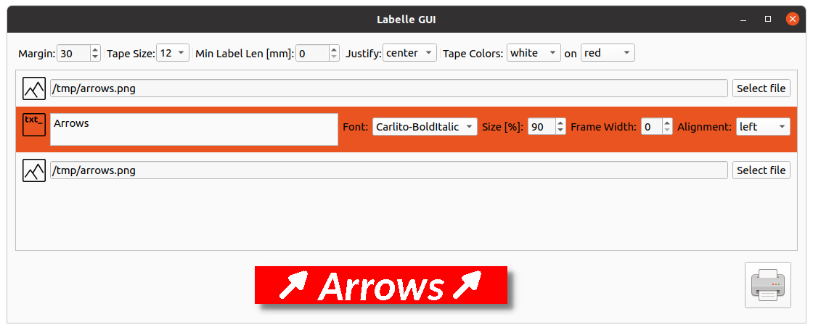

# Labelle

[](https://github.com/labelle-org/labelle)
[](https://pypi.org/project/labelle/)
[](https://results.pre-commit.ci/latest/github/labelle-org/labelle/main)

<!-- markdownlint-disable MD033 -->

<p align="center">
  </img>
</p>

<!-- markdownlint-enable MD033 -->

## Open-source label printing software

* First version from Sebastian Bronner: <https://sbronner.com/dymoprint.html>
* Cloned to Github and maintained by
  [@computerlyrik](https://github.com/computerlyrik) and later
  [@maresb](https://github.com/maresb): <https://github.com/computerlyrik/dymoprint>
* Migrated to `labelle-org` and maintained by
  [@tomers](https://github.com/tomers), [@maresb](https://github.com/maresb),
  and [@tomek-szczesny](https://github.com/tomek-szczesny):
  <https://github.com/labelle-org/labelle>

## Features

* Text printing
* QR code printing
* Barcode printing
* Image printing
* Combinations of the above
* GUI Application based on PyQt6
* Windows support by setting the driver to WinUSB using [Zadig](https://zadig.akeo.ie/)

### Supported devices

* DYMO LabelManager PC
* DYMO LabelPoint 350
* DYMO LabelManager 280
* DYMO LabelManager 420P
* DYMO LabelManager Wireless PnP

Labelle is not affiliated with DYMO. Please see the [disclaimer](#disclaimers) below.

For more information about experimental device support, see [#4](https://github.com/labelle-org/labelle/issues/4).

If you have a device or tape size that we do not yet support, the first step is
to try and get it to print. In some cases this is as simple as
[adding the device id](src/labelle/lib/constants.py). Once you can print,
you can help us determine the print head size and margins for your tape sizes
by following [these instructions](doc/margin-calibration-howto.md).

## Installation

It is recommended to install Labelle with
[pipx](https://pypa.github.io/pipx/) so that it runs in an isolated virtual
environment:

```bash
pipx install labelle
```

In case pipx is not already installed, it can be installed on Ubuntu/Debian with

```bash
sudo apt-get install pipx
```

or on Arch with

```bash
sudo pacman -S python-pipx
```

In case the USB development libraries are not already installed, you may see an
error like

```python
DeviceManagerError: Failed scanning devices: No backend available
```

To fix this, on Ubuntu/Debian, install with

```bash
sudo apt-get  --no-install-recommends install libusb-1.0-0
```

By default, users don't have permission to access generic USB devices, so you will
need to add a rule. The first time you run `labelle`, it will give instructions
about how to do this:

<!-- markdownlint-disable MD013 -->

```bash
$ labelle "Hello world"
...
You do not have sufficient access to the device. You probably want to add the a udev rule in /etc/udev/rules.d with the following command:

  echo 'ACTION=="add", SUBSYSTEMS=="usb", ATTRS{idVendor}=="0922", ATTRS{idProduct}=="1001", MODE="0666"' | sudo tee /etc/udev/rules.d/91-labelle-1001.rules
...
```

<!-- markdownlint-enable MD013 -->

## Testing experimental features

To install a test branch, by GitHub user `ghuser` for the branch `branchname`, run

```bash
pipx install --force git+https://github.com/ghuser/labelle@branchname
```

To revert back to the release version, run

```bash
pipx install --force labelle
```

To install a particular release version, specify `labelle==x.y.z` in place of
`labelle` in the above command.

## Development and code style

To install for development, fork and clone this repository, and run (ideally
within a venv):

```bash
pip install --editable .
```

This project uses [pre-commit](https://pre-commit.com/) to run some checks
before committing.
After installing the `pre-commit` executable, please run

```bash
pre-commit install
```

## Font management

Default fonts are managed via [labelle.ini](labelle.ini).
This should be placed in your config folder (normally `~/.config`).
An example file is provided here.

For my Arch-Linux System, fonts are located at e.g.

```bash
/usr/share/fonts/TTF/DejaVuSerif.ttf
```

It is also possible to Download a font from
<http://font.ubuntu.com/> and use it.

For font discovery, Labelle contains code excerpts from
[`matplotlib`](https://github.com/matplotlib/matplotlib/).
See [here](vendoring/README.md) for more information and
[LICENSE](src/labelle/_vendor/matplotlib/LICENSE) for the license.

Labelle includes the Carlito font, licensed under the
[SIL Open Font License](src/labelle/resources/fonts/LICENSE).

## Modes

### Print text

```labelle MyText```

Multilines will be generated on whitespace

```labelle MyLine MySecondLine # Will print two Lines```

If you want whitespaces just enclose in " "

```labelle "prints a single line"```

### Print QRCodes and Barcodes

```labelle --help```

### Print Codes and Text

Just add a text after your qr or barcode text

```labelle -qr "QR Content" "Cleartext printed"```

### Picture printing

Any picture with JPEG standard may be printed. Beware it will be downsized to tape.

```labelle -p mypic.jpg ""```

Take care of the trailing "" - you may enter text here which gets printed in
front of the image

## GUI

### Run Labelle GUI

```labelle-gui```

### GUI App Features

* Live preview
* margin settings
* type size selector
* visualization of tape color schema
* the ability to freely arrange the content using the "Node" list
  * Text Node:
    * payload text - can be multi-line
    * font selector
    * font scaling - the percentage of line-height
    * frame border width steering
  * Qr Node:
    * payload text
  * BarCode Node:
    * payload text
    * codding selector
  * Image Node:
    * path to file

Nodes can be freely arranged, simply drag&drop rows on the list.
To add or delete the node from the label - right-click on the list and select
the action from the context menu. To print - click the print button.

### Example

Example 1: multiple text + QR code


Example 2: two images + text with frame, white on red



Example 3: barcode with text, text, image


## About the name

The name "Labelle" is a multilingual pun by [@claui](https://github.com/computerlyrik/dymoprint/issues/114#issuecomment-1978982019).

<!-- markdownlint-disable MD013 -->

| Language | Word/Interpretation   | Meaning           | Pronunciation (IPA) | Simplified Phonetic Spelling |
|----------|-----------------------|-------------------|---------------------|------------------------------|
| English  | Label                 | A printed sticker | /ˈleɪbəl/           | LAY-buhl                     |
| French   | La belle              | The beautiful     | /la bɛl/            | lah BEL                      |
| German   | Libelle (sounds like) | Dragonfly         | /liˈbɛlə/           | lee-BELL-uh                  |

<!-- markdownlint-enable MD013 -->

## Disclaimers

* This software is provided as-is, without any warranty. Please see [LICENSE](LICENSE)
  for details.
* Labelle is not affiliated, associated, authorized, endorsed by, or in any way
  officially connected with DYMO, or any of its subsidiaries or its affiliates.
  The official DYMO website can be found at [www.dymo.com](https://www.dymo.com).
  The name DYMO®, as well as related names, marks, emblems, and images, are registered
  trademarks of their respective owners. Currently, Labelle software is designed
  to support certain devices manufactured by DYMO; however, no endorsement or
  partnership is implied.
