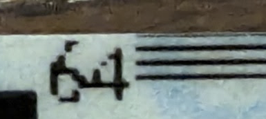

# How to calibrate the label margins of DYMO printers

Each model of DYMO printer has a stationary print head of a given width.
Most DYMO printers support 6mm, 9mm, and 12mm D1 tapes
and have a 64 pixel print head with a 9mm printable area.

The LabelManager PC II also supports 19mm and 24mm D1 tapes
and has a 128 pixel print head with a 19mm printable area.

When the tape is smaller than the printable area, the tape occupies
some range of pixels near the middle of the print head.
We can identify the precise range of pixels by means of
a sample pattern of a given height.
The 64 pixel pattern is:

<!-- markdownlint-disable MD033 -->

<!-- markdownlint-enable MD033 -->

The dyadic checkerboard is designed to help with counting rows of pixels.
In our numbering, the bottom row is 1 and the top row is 64.
Groups of 16 pixels in alternating colors are indicated by the numbers.
The 48th row is the topmost row within the black block marked as 48.
To the left are alternating groups of 8, 4, 2, and 1 pixels.

On the left and right sides of the pattern are groups of four
staggered horizontal lines along both the top and bottom.
These are helpful for checking whether or not
the topmost and bottommost pixels are printed.

Here it is printed on 12mm tape with a DYMO LabelManager PnP:

Printed instead on a 9mm tape, the 64 pixel pattern
fills exactly the height of the tape:

Notice however that the 1st and 64th pixels, being right on the edge,
are significantly fainter than the rest:

