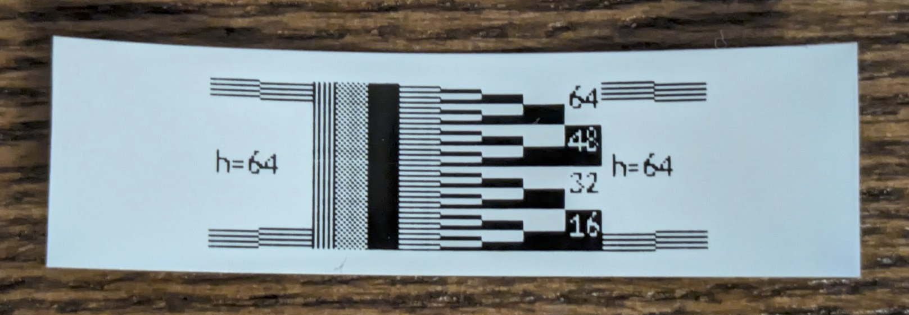

# How to calibrate the label margins of DYMO printers

The goal of calibration is to determine:

1. How many pixels does the print head have?
2. For a given tape, which pixels correspond to which part of the tape?

Each model of DYMO printer has a stationary print head of a given height.
Most DYMO printers support 6mm, 9mm, and 12mm D1 tapes
and have a 64 pixel print head with a 9mm printable height.

The LabelManager PC II has a 128 pixel print head with an 18mm printable height.
This makes it practical for use with the larger 19mm and 24mm D1 tapes.
An unofficial list of DYMO printers and compatible tape sizes
can be found [here](https://www.labelcity.com/dymo-d1-label-tape-compatibility-guide).

When the tape is shorter than the printable height, the tape occupies
some range of pixels near the middle of the print head.
We can identify the precise range of pixels by means of
a sample pattern of a given height.
The 64 pixel pattern is:

<!-- markdownlint-disable MD033 -->

<!-- markdownlint-enable MD033 -->

The numbering of rows increases from bottom to top.
To make counting more human-friendly, we start counting with 1.
Therefore, the bottom row is 1 and the top row is 64.
Groups of 16 pixels in alternating colors are indicated by the numbers.
The 48th row is the topmost row within the black block marked as 48.
The dyadic checkerboard is designed to help with counting individual rows of pixels.
To the left of the numbers are alternating groups of 8, 4, 2, and 1 pixels.

Around each of the four corners of the pattern are groups of four
staggered horizontal lines along both the top and bottom.
These are helpful for checking whether or not
the topmost and bottommost pixels are printed.

Here is the 64-pixel pattern printed on 12mm tape with a DYMO LabelManager PnP
with the command

```shell
labelle --sample-pattern 64
```



Printed instead on a 9mm tape, the 64 pixel pattern
fills exactly the height of the tape:


Notice however that the 1st and 64th pixels, being right on the edge,
are significantly fainter than the rest:


